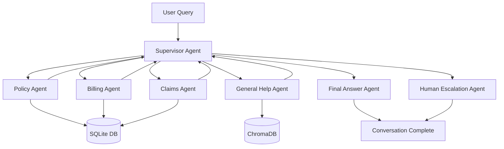

# Building an Intelligent Multi-Agent Insurance Support System with LangGraph and RAG

  

## Overview

This project walks through an end-to-end insurance support copilot that combines LangGraph, Retrieval-Augmented Generation (RAG), and structured data to resolve customer requests. The companion notebook (`multi-agent system.ipynb`) shows how to stand up the data stack, orchestrate specialized agents, and observe every hop with Phoenix tracing.

## What’s New in the Notebook

- **Phoenix-powered observability**: every agent function is wrapped with an OpenTelemetry span so you can replay decisions inside Arize Phoenix.
- **Clarification-aware supervisor**: the router uses OpenAI function calling to request missing context before delegating work.
- **Final answer agent**: conversations end with a summarizer that rewrites the last specialist message into a customer-ready response.
- **Guard rails for infinite loops**: the supervisor escalates to a human after three failed routing attempts.
- **Notebook test harness**: reusable `run_test_query` helper to exercise the full graph from within the notebook.

## Tech Stack

- **LangGraph** for multi-agent workflow orchestration.
- **OpenAI GPT-5 Mini** for routing, tool-calling, and final responses.
- **SQLite** for relational policy, billing, and claims data.
- **ChromaDB** for semantic FAQ retrieval.
- **Arize Phoenix** (OpenTelemetry backend) for tracing and debugging.

## Architecture



The LangGraph workflow is compiled into a state machine. Each specialist node returns to the supervisor, which decides whether to continue the loop, escalate, or pass control to the final answer agent.

## Data Foundations

1. **FAQ Retrieval (ChromaDB)**
   - Hugging Face dataset `deccan-ai/insuranceQA-v2` is ingested and embedded into a persistent Chroma collection (`insurance_FAQ_collection`).
   - Retrieval batches (size 100) keep ingest jobs fast while respecting API limits.

2. **Synthetic Insurance Warehouse (SQLite)**
   - 1,000 customers, 1,500 policies, and supporting billing, payments, and claims tables.
   - `setup_insurance_database(sample_data)` drops and recreates the schema before inserting fresh synthetic rows, ensuring notebook re-runs stay deterministic.

## Monitoring with Phoenix

Every agent is decorated with `@trace_agent`, a wrapper that:
- Opens a Phoenix span with metadata such as `agent.name`, `policy.number`, and duration.
- Captures exceptions and marks spans with `StatusCode.ERROR` for quick triage.
- Provides a consistent way to correlate user journeys in Phoenix’s UI.

```python
@trace_agent
def billing_agent_node(state):
    logger.info("📊 Billing agent started")
    # ... call tools, update state, emit telemetry ...
    return updated_state
```

Phoenix endpoint and OpenAI credentials are loaded from `.env`, so be sure to set `OPEN_AI_KEY` and `PHOENIX_COLLECTOR_ENDPOINT` before running the notebook.

## Graph State & Routing Logic

The notebook defines a richer `GraphState` that persists:

```python
class GraphState(TypedDict):
    messages: Annotated[List[Any], add_messages]
    user_input: str
    conversation_history: Optional[str]
    n_iteration: Optional[int]
    user_intent: Optional[str]
    customer_id: Optional[str]
    policy_number: Optional[str]
    claim_id: Optional[str]
    next_agent: Optional[str]
    task: Optional[str]
    justification: Optional[str]
    end_conversation: Optional[bool]
    extracted_entities: Dict[str, Any]
    database_lookup_result: Dict[str, Any]
    requires_human_escalation: bool
    escalation_reason: Optional[str]
    billing_amount: Optional[float]
    payment_method: Optional[str]
    billing_frequency: Optional[str]
    invoice_date: Optional[str]
    timestamp: Optional[str]
    final_answer: Optional[str]
```

- **Clarification cycle**: When the supervisor invokes the `ask_user` tool, it sets `needs_clarification` and waits for the follow-up before re-routing.
- **Loop breaker**: After three supervisor loops, the state is forced to `human_escalation_agent`.
- **END detection**: When `end_conversation` flips to `True`, the graph routes to `final_answer_agent` which pushes the user-facing summary back into the state.

## Specialist Agents

- **Policy / Billing / Claims Agents** use structured tool calls (`get_policy_details`, `get_payment_history`, `get_claim_status`) to ground outputs in SQLite.
- **General Help Agent** retrieves the top three FAQ snippets from Chroma, annotating answers with relevance scores.
- **Human Escalation Agent** acknowledges the handoff and logs `escalation_reason` for operational dashboards.
- **Final Answer Agent** rewrites the latest specialist response into a polite closing stanza so that users always receive a clean summary.

## Running the Notebook

1. `pip install -r requirements.txt`
2. Populate environment variables (`OPEN_AI_KEY`, `PHOENIX_COLLECTOR_ENDPOINT`).
3. Run the “Data Infrastructure” cells to seed Chroma and SQLite.
4. Execute the “Setting up Nodes and Edges in LangGraph” section to compile the workflow and render the mermaid preview.
5. Use the testing helpers to exercise scenarios:

```python
run_test_query("What is the premium of my auto insurance policy?")
run_test_query("In general, what does life insurance cover?")
run_test_query("I want to talk to human executive")
```

Each invocation prints the agent hop trace and the final customer answer.

## Sample Walkthroughs

- **Billing Premium Lookup**: Supervisor obtains the missing policy number, billing agent queries SQLite, final answer agent produces a concise plan overview.
- **FAQ Support**: Supervisor detects general intent, FAQ agent returns a grounded answer with retrieved context, and the final agent wraps up with a friendly closing.
- **Escalation Path**: Explicit escalation requests or three failed supervisor loops push control to the human escalation agent, preserving the conversation history for handoff.

## Next Steps

1. Plug in live insurance systems by swapping the SQLite helpers for REST or gRPC clients.
2. Extend RAG coverage with additional knowledge bases (policy booklets, state regulations).
3. Add automated evaluation by replaying `run_test_query` scenarios with Phoenix traces and regression metrics.
5. **User Experience** - Natural conversation flow with context retention


## 🔍 Technical Stack

| Component | Technology |
|-----------|-----------|
| Orchestration | LangGraph |
| LLM | OpenAI GPT-4 |
| Vector DB | ChromaDB |
| Relational DB | SQLite |
| Embeddings | Sentence Transformers |
| Framework | LangChain Community |
| Data Processing | Pandas, NumPy |
| Logging | Python logging |

---

## 🎓 Key Learnings

### 1. **State Design is Critical**

Designing a comprehensive state structure upfront saves refactoring later. Include fields for:
- Conversation tracking
- Entity extraction
- Routing decisions
- Escalation flags

### 2. **Prompt Engineering for Routing**

The supervisor prompt must:
- Clearly define agent responsibilities
- Provide decision guidelines
- Request structured output (JSON)
- Avoid redundant questions

### 3. **RAG Requires Quality Data**

The General Help Agent's effectiveness depends on:
- Curated FAQ datasets
- Proper chunking and metadata
- Relevance scoring thresholds
- Fallback strategies for low-confidence matches

### 4. **Tool Design Matters**

Effective tools should:
- Have clear, specific purposes
- Return structured data
- Handle errors gracefully
- Log all database queries

---

## 🔮 Future Enhancements

### 1. **Memory and Personalization**

Add long-term memory to remember:
- Customer preferences
- Past issues and resolutions
- Communication style

### 2. **Proactive Assistance**

Agents could:
- Predict user needs based on patterns
- Send reminders for upcoming renewals
- Alert about policy changes

### 3. **Multi-Modal Support**

Extend to handle:
- Document uploads (claim photos)
- Voice interactions
- Video consultations

### 4. **Advanced Analytics**

Implement:
- Sentiment analysis for escalation prediction
- Conversation quality metrics
- Agent performance dashboards

### 5. **Fine-Tuned Models**

Train domain-specific models:
- Insurance entity extraction
- Intent classification
- Response generation

---

## 🛠️ Getting Started

### Installation

```bash
# Clone the repository
git clone https://github.com/alphaiterations/multi-agent-system.git
cd multi-agent-system

# Install dependencies
pip install -r requirements.txt
```

### Configuration

Create a `.env` file:
```
OPEN_AI_KEY=your_openai_api_key
```

### Running the System

```python
# Initialize the database
setup_insurance_database()

# Load FAQ data into ChromaDB
collection = client.get_or_create_collection(name="insurance_FAQ_collection")

# Run a test query
test_query = "What is my auto insurance premium?"
final_output = run_test_query(test_query)
```

---

## 📚 Dependencies

```
langgraph
langchain-openai
langchain-community
chromadb
sentence-transformers
pandas
scikit-learn
datasets
python-dotenv
beautifulsoup4
requests
```

---

## 🤝 Contributing

This is an open-source project demonstrating multi-agent AI systems. Contributions are welcome!

**Areas for contribution:**
- Additional agent types (fraud detection, underwriting)
- Improved routing logic
- Enhanced RAG strategies
- Performance optimizations
- Testing and evaluation frameworks

---

## 💭 Conclusion

Multi-agent AI systems represent a paradigm shift in how we build intelligent applications. By combining:
- **Specialized agents** for domain expertise
- **Orchestration frameworks** like LangGraph for workflow management
- **RAG** for grounded, accurate responses
- **Function calling** for data access

We can create systems that match or exceed human customer service quality while scaling infinitely.

This insurance support system demonstrates these principles in action, handling complex queries through intelligent routing, context management, and specialized processing.

The future of customer support isn't a single AI assistant—it's a **team** of specialized AI agents working together seamlessly.

---

## 📞 Contact & Resources

- **Repository**: [github.com/alphaiterations/multi-agent-system](https://github.com/alphaiterations/multi-agent-system)
- **LangGraph Docs**: [langchain-ai.github.io/langgraph](https://langchain-ai.github.io/langgraph/)
- **ChromaDB**: [docs.trychroma.com](https://docs.trychroma.com/)

---

## 📄 License

This project is open-source and available under the MIT License.

---

*Built with ❤️ using LangGraph, OpenAI, and ChromaDB*

---

## Appendix: Project Structure

```
multi-agent-system/
├── agnetic-rag.ipynb              # RAG implementation notebook
├── multi-agent system.ipynb       # Main multi-agent system
├── requirements.txt               # Python dependencies
├── enhanced_workflow.mmd          # Mermaid workflow diagram
├── chroma_db/                     # Vector database storage
│   ├── chroma.sqlite3
│   └── 13cdf4c1-7894-4026-9ea8-46a4482514e0/
├── insurance_support.db           # SQLite database (generated)
└── README.md                      # This file
```

---

**Happy Building! 🚀**

If you found this article helpful, please ⭐ the repository and share your experience building multi-agent systems!
